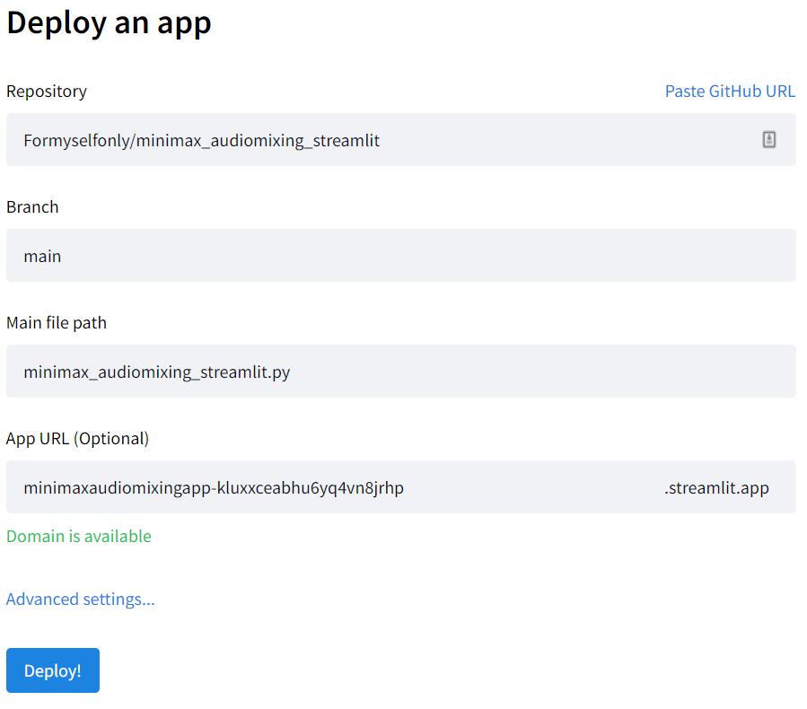

# readme

## 功能&使用步骤

1. 输入文本

2. 拖动滑杆,进行混音

   混音分为男角色混音和女角色混音

   有四种音色可供选择,根据权重进行混音

3. 点击文本转语音

## 部署步骤

### 第一步

Fork本项目(有空可以伸手Star一下)

### 第二步

[在streamlit里面部署](https://share.streamlit.io/deploy)_

将配置设为自己的项目名称和文件路径后
如下图所示,点击部署即可

### 第三步-完工

